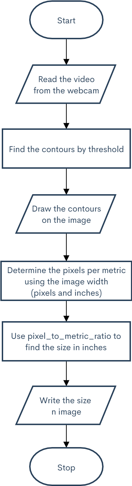
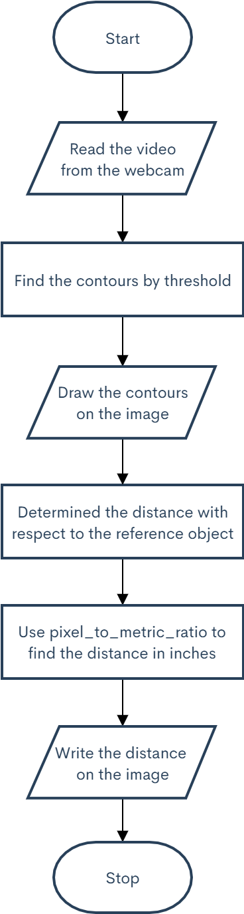
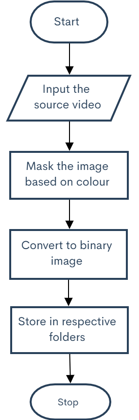
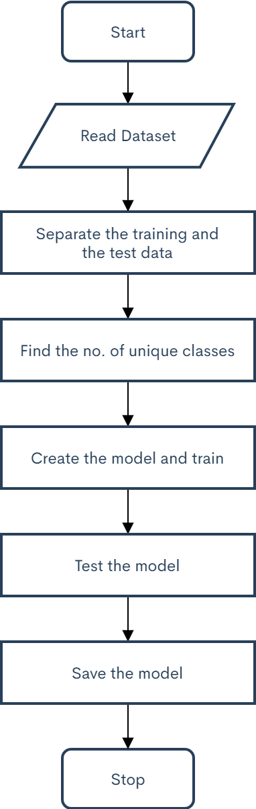
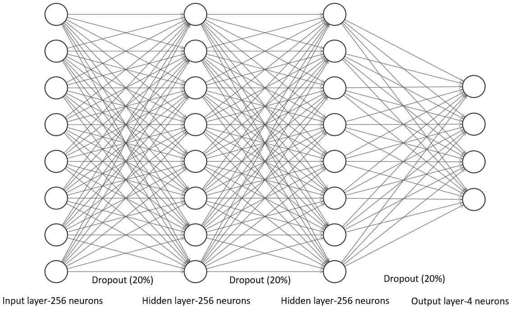
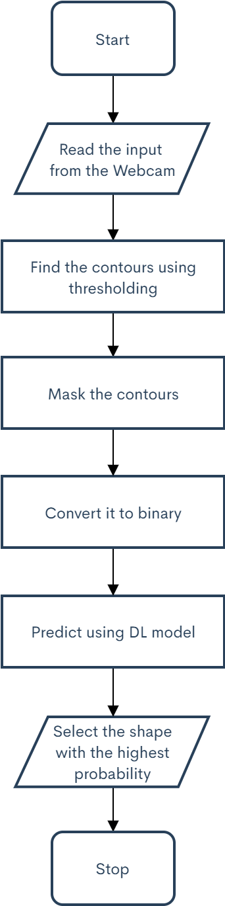
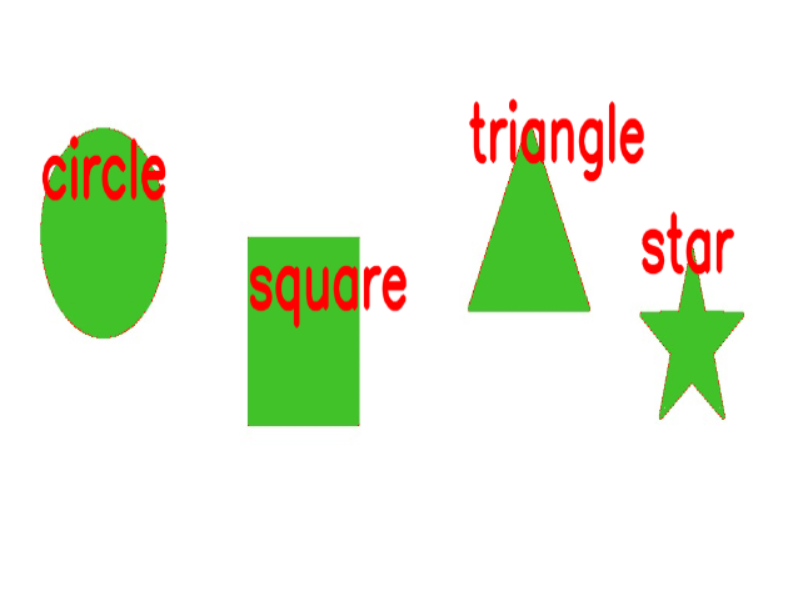

## Contents:
<ol>
   <li><a href="https://s-nithish-kumar.github.io/Determining_the_Size_Distance_Depth_and_Shape_of_Objects_using_Computer_Vision_and_Deep_Learning/#1-problem-statement">Problem Statement</a></li>
   <li><a href="https://s-nithish-kumar.github.io/Determining_the_Size_Distance_Depth_and_Shape_of_Objects_using_Computer_Vision_and_Deep_Learning/#2-objectives">Objectives</a></li>
   <li><a href="https://s-nithish-kumar.github.io/Determining_the_Size_Distance_Depth_and_Shape_of_Objects_using_Computer_Vision_and_Deep_Learning/#3-impact-of-solving-the-problem">Impact of Solving the Problem</a></li>
   <li><a href="https://s-nithish-kumar.github.io/Determining_the_Size_Distance_Depth_and_Shape_of_Objects_using_Computer_Vision_and_Deep_Learning/#4-proposed-approach">Proposed Approach</a></li>
   <li><a href="https://s-nithish-kumar.github.io/Determining_the_Size_Distance_Depth_and_Shape_of_Objects_using_Computer_Vision_and_Deep_Learning/#5-implementation-of-size-measurement">Implementation of Size Measurement</a></li>
   <li><a href="https://s-nithish-kumar.github.io/Determining_the_Size_Distance_Depth_and_Shape_of_Objects_using_Computer_Vision_and_Deep_Learning/#6-implementation-of-distance-calculation">Implementation of Distance Calculation</a></li>
   <li><a href="https://s-nithish-kumar.github.io/Determining_the_Size_Distance_Depth_and_Shape_of_Objects_using_Computer_Vision_and_Deep_Learning/#7-implementation-of-depth-camera-to-object-distance-calculation">Implementation of Depth (Camera to object distance) calculation</a></li>
   <li><a href="https://s-nithish-kumar.github.io/Determining_the_Size_Distance_Depth_and_Shape_of_Objects_using_Computer_Vision_and_Deep_Learning/#8-deep-learning-model-for-object-shape-classification">Deep learning model for Object Shape Classification</a>
   <ul>
      <li><a href="https://s-nithish-kumar.github.io/Determining_the_Size_Distance_Depth_and_Shape_of_Objects_using_Computer_Vision_and_Deep_Learning/#data-collection">Data Collection</a></li>
      <li><a href="https://s-nithish-kumar.github.io/Determining_the_Size_Distance_Depth_and_Shape_of_Objects_using_Computer_Vision_and_Deep_Learning/#training-deep-learning-model">Training Deep Learning Model</a></li>
      <li><a href="https://s-nithish-kumar.github.io/Determining_the_Size_Distance_Depth_and_Shape_of_Objects_using_Computer_Vision_and_Deep_Learning/#shape-prediction">Shape Prediction</a></li>
   </ul></li>
   <li><a href="https://s-nithish-kumar.github.io/Determining_the_Size_Distance_Depth_and_Shape_of_Objects_using_Computer_Vision_and_Deep_Learning/#9-results">Results</a></li>
   <li><a href="https://s-nithish-kumar.github.io/Determining_the_Size_Distance_Depth_and_Shape_of_Objects_using_Computer_Vision_and_Deep_Learning/#10-problems-and-troubleshooting">Problems and Troubleshooting</a></li>
   <li><a href="https://s-nithish-kumar.github.io/Determining_the_Size_Distance_Depth_and_Shape_of_Objects_using_Computer_Vision_and_Deep_Learning/#11-conclusion-and-future-works">Conclusion and Future Works</a></li>
   <li><a href="https://s-nithish-kumar.github.io/Determining_the_Size_Distance_Depth_and_Shape_of_Objects_using_Computer_Vision_and_Deep_Learning/#12-references">References</a></li>
</ol>

### 1. Problem Statement:
- Determining the location of objects in an arena plays a major role in manufacturing industries where objects will be picked from and placed at another location.
- Using a stereo camera can help find the size and distance between objects, but the cost of the sensor and the computational power required for processing the algorithm are high.

### 2. Objectives:
- Calculate the size of objects, the distance between two objects, and the depth (how far the object is from the camera) using simple computer Vision techniques.
- Predict the shape of objects using a deep learning model.
- Combine the techniques used to find the size, distance, and depth into a single module.

### 3. Impact of Solving the Problem:
- Pick and place Robots used in manufacturing industries need to localize objects to pick them up. This algorithm can provide the robot controller with the features needed to find the location of the object with respect to its coordinate frame.
- This algorithm replaces the need for a sophisticated controller for processing the image.
- Providing the shape of the object helps the robot decide the most convenient way to pick it up.

### 4. Proposed Approach:
Determining the size of the object is the first motive, and in order to perform this task, there are two ways.
#### Option #1:
A reference object can be used. The dimensions of the selected reference object should be known (width and height) in any unit, such as millimeters, inches, etc., and the reference object must be placed either in the left or right corner of the image so that the contour of the reference object can be detected easily.

#### Option #2:
This method does not require a reference object; instead, the width of the background (distance from the left corner to the right corner) in the image must be known. The second method is used here as it is found to be more accurate than the first method. 
The pixels_per_metric can be defined as, 

Pixels_per_metric = Object_width / know_width 

The width of the background in this case is 17 inches. The background width (measured in pixels) is calculated to be 1280 pixels. 

Pixels_per_metric = 1280px / 17in = 75px (approximately) 

Therefore, there were approximately 75 pixels per inch in the image taken. Using this formula, the size of the objects present in any given image can be calculated.

### 5. Implementation of size measurement:
The above methodology is implemented using the OpenCV library in Python. Individual objects are detected through Canny thresholds and Contours. Using the contour area, the center of each object is found. Then the size is found using the pixel_per_metric_ratio, as seen above. Figure depicts the algorithm for measuring the size of an object.

Figure 1 Algorithm for measuring the size of the object

### 6. Implementation of Distance Calculation:
Individual objects are detected with the help of Canny thresholds and Contours. Using the contour area, the center of each object is found. Then the center-to-center distance between the object and the reference object (the leftmost object in the image) is found by using the pixel_per_metric_ratio. Figure 6 depicts the algorithm for measuring the distance between the objects.

Figure 2 Algorithm for measuring the distance between objects

### 7. Implementation of Depth (Camera to object distance) calculation:
This module involves the calculation of the distance between the camera and the known object. A square of the size of 1.5 x 1.5 inches is chosen as the reference object. First, the focal length F of the camera is found using the following formula:

F = (P x D) / W

W is the width of the reference object in inches
P is the width of the reference object in pixels
D is the measured distance from the camera to the reference object
In this case, W=1.5 inches, P = 119 pixels (approximately), D=12 inches.

F = (119 x 12) / 1.5 = 952 (approximately)

Now, the focal length of the camera is known. Using this formula, the distance of the reference object from the camera is found, even after changing the distances between them.

### 8. Testing and Validation:
#### Data Collection:
A total of 16000 images were collected for four categories (circle, square, triangle, and star), of which 80% were used for training and 20% for testing.

Figure 3 Algorithm for dataset collection

#### Training Deep Learning Model:

Figure 4 Algorithm for Building and training model

Figure 5 Architecture of the Deep Learning Model

Fig 2 depicts the algorithm for building and training the model. The dataset is loaded and divided into training data and test data. The actual image size is 200 x 200 pixels but before the images are fed into the model, they are resized to 60x60 pixels. Fig 3 depicts the architecture of the model. A model consisting of three layers has been created. The input layer and the following two hidden layers consist of 256 neurons, and the output layer consists of 4 neurons. For the input and the first hidden layer, the "tanh" activation function is used; for the second hidden layer, "relu" activation is used; and for the output layer, "softmax" activation is used. A dropout layer with 20% dropout has been added after each layer. "rmsprop" is used as the optimizer. The model has been trained for 50 epochs. After training, the model has been tested with the test data and is saved. The overall accuracy of the model is 99.7%.

#### Prediction:

Figure 6 Algorithm for predicting a new image

Figure 4 depicts the algorithm for predicting the new image. Real-time video captured from the integrated web camera is fed into the OpenCV script. The OpenCV script uses the Canny threshold technique to find out the contours of the individual objects. Only contours within a particular size range will be considered in order to filter out the noise. These contours are individually masked so that only one object will be considered at a time. These masked images are then resized in order to match the training data and are then fed into the trained Tensorflow-Keras model for prediction. As mentioned earlier, the model has four outputs consisting of the probability of the input shape with all the other shapes, and the class with the highest probability is considered the input object shape.

### 9. Results:
**_Distance between objects and depth measurement_**

**_Size of the objects_**

**_Objects drawn using Microsoft paint are classified_**

**_Objects drawn on paper are classified_**

### 10. Problems and Troubleshooting:
- After the contours are found, padding is added to the images before object classification. The value of padding is important to the accuracy of the prediction.
- The padding value is determined with a few iterations, and if the objects are too small or too large, the model is unable to predict the correct shapes.
- Improper lighting resulted in multiple small false contours. Lights are used to ensure the appropriate brightness levels.

### 11. Conclusion and Future Works:
- The size of the objects, the distance between the objects, and the distance between the camera and the reference object were determined using various techniques. Hence, these algorithms could be used as inputs for algorithms used in pick-and-place robots.
- A deep learning model for the classification of objects is developed with an accuracy of 99.7%.
- For the camera-to-object distance measurement, the largest contour is considered the reference object. In real-time implementation, it would be helpful if the reference object could be identified using color. This work will be done in the future.

### 12. References:
1. Fayaz Shahdib, Md. Wali Ullah, Md. Kamrul Hasan, Hasan Mahmud, Islamic University of Technology, Bangladesh, “Obstacle detection and object size measurement for Autonomous mobile robot using sensor”, International Journal of Computer Applications, March 2013.
2. Amelia Azman, M. Hanafi Ani, International Islamic University Malaysia, “Object Distance and Size measurement using Stereo Vision system”, Advanced Materials Research, December 2012.
3.	Liu Xiaoming, Wanchun Chen, Beihang University, “Real time distance measurement using a modified camera”, Research gate, February 2010.
4.	Nisha, Dinesh Kumar, Sekar, Indira, Tamilnadu, India, “Vision Assisted Pick and Place Robotic Arm”, September 2015.
5.	Rahul Kumar, Sanjesh Kumar, Sunil Lal, Praneel Chand, The University of the South Pacific Suva, Fiji, “Object Detection and Recognition for a Pick and Place Robot”, November 2014.
6.	https://www.kaggle.com/smeschke/four-shapes
7.	https://www.pyimagesearch.com/2021/01/19/image-masking-with-opencv/
8.	https://www.pyimagesearch.com/2021/03/29/multi-template-matching-with-opencv/
9.	https://www.pyimagesearch.com/2021/04/28/opencv-morphological-operations/

